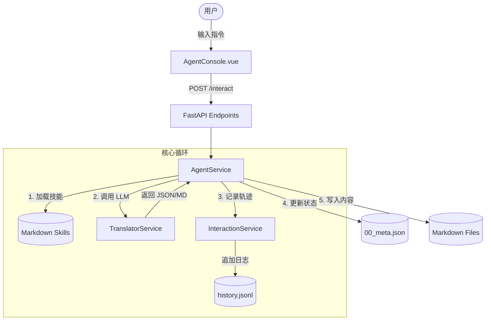

# DeepTree Author 2.0 核心逻辑与调用关系文档

DeepTree Author 是一个基于递归认知代理（Recursive Cognitive Agent）的数学书籍创作系统，采用“自顶向下”的生成策略。

## 1. 核心架构组件

### 1.1 后端服务 (Backend Services)
*   **AgentService (`backend/app/services/agent_service.py`)**: 
    *   **核心编排器**：管理书籍的全生命周期状态（init -> reviewing -> writing -> ready）。
    *   **技能调度**：根据当前阶段加载对应的 Markdown 技能模板（Prompt）。
    *   **并行任务管理**：使用 `asyncio.Semaphore` 控制并发 LLM 调用。
*   **InteractionService (`backend/app/services/interaction_service.py`)**:
    *   **认知轨迹（Cognitive Trajectory）**：将 LLM 的推理 Trace、用户的反馈和系统决策持久化为 `history.jsonl`。
    *   **上下文回溯**：为 `writer` 提供之前的创作摘要，确保数学一致性。
*   **TranslatorService (`backend/app/services/translator.py`)**:
    *   统一的 LLM 抽象层，支持 OpenAI, Anthropic 和 Gemini。

### 1.2 核心技能 (AI Skills)
位于 `backend/app/skills/`：
*   **Architect (`architect.md`)**: 负责“愿景”设计和初始目录树（TOC）生成。
*   **Refiner (`refiner.md`)**: 交互式调整逻辑，处理增删改目录节点的复杂指令。
*   **Writer (`writer.md`)**: 深度写作逻辑，负责将数学概念转化为高质量的 KaTeX Markdown。

## 2. 核心工作流 (Workflow)

### 2.1 初始化 (Initialization)
1.  用户通过 `AgentModal.vue` 提供数学领域（如“群论”）。
2.  调用 `/agent/init`，在 `storage/` 下创建 UUID 文件夹及初始 `00_meta.json`。

### 2.2 架构构建 (Architecting)
1.  用户输入 `build`。
2.  `AgentService` 调用 LLM (Architect Skill) 生成教学愿景和完整目录。
3.  系统解析 JSON 并同步至 `00_meta.json`，状态变更为 `reviewing`。

### 2.3 交互精炼 (Interactive Refinement)
1.  用户在 `AgentConsole.vue` 输入修改指令（如“在第二章增加对共轭类的讨论”）。
2.  `AgentService` 将“当前目录 + 愿景 + 用户指令”发送给 LLM (Refiner Skill)。
3.  LLM 返回更新后的目录树，系统实时更新预览。

### 2.4 递归深度创作 (Recursive Deep Dive)
1.  用户确认后输入 `confirm`。
2.  系统锁定目录，进入 `writing` 阶段。
3.  **并行生成**：系统遍历 TOC 中所有节点，启动多个协程。
4.  每个章节生成时，通过 `InteractionService` 获取“认知摘要”，保证符号约定（如 $G$ 表示群，$e$ 表示单位元）在全书统一。
5.  文件持久化至 `book_md/`。

## 3. 调用关系图 (Call Graph)

## 4. 关键技术细节

*   **JSON 鲁棒解析**：`_extract_json` 方法结合了正则表达式和多种清理策略，确保即使 LLM 输出包含 Markdown 代码块也能正确提取数据。
*   **Semaphore 并发控制**：为了防止触发 API Rate Limit 并保证生成质量，创作阶段采用了 `asyncio.Semaphore(3)`。
*   **KaTeX 优先**：所有技能模板均强制要求数学公式使用 KaTeX 语法，确保前端渲染的一致性。
*   **目录树校验**：`_validate_tree_structure` 递归检查 LLM 返回的树结构，修复缺失的 ID 或非法的子节点格式。

---
*文档生成日期：2026-02-16*
